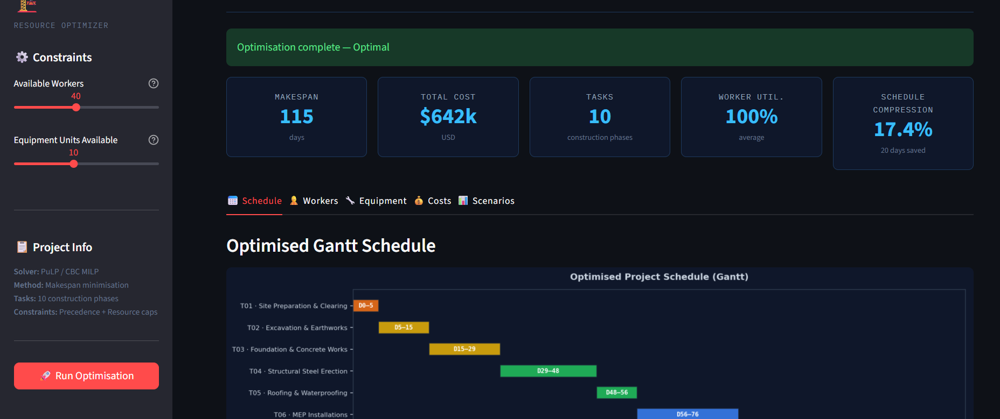
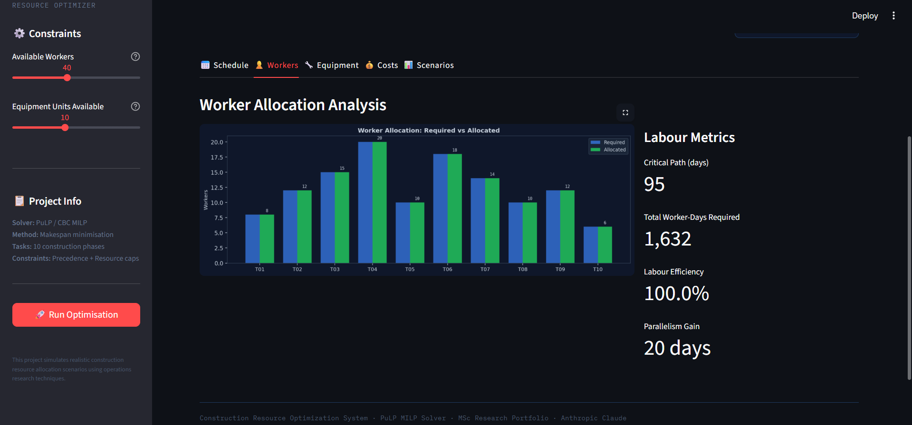
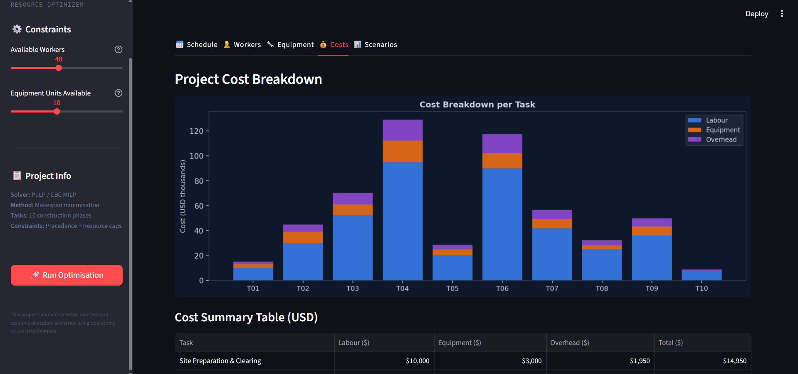
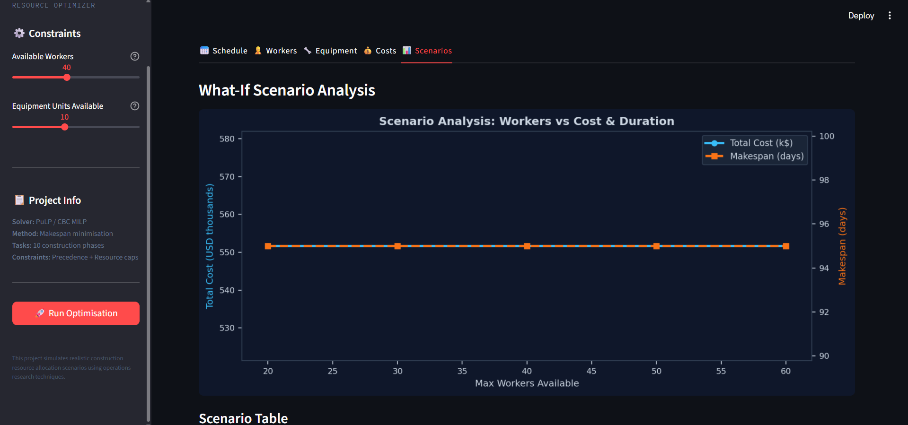

# 🏗️ Construction Resource Optimization System

> **"This project simulates realistic construction resource allocation scenarios using operations research techniques."**

A research-grade Python application that applies **Mixed-Integer Linear Programming (MILP)** to optimise the allocation of labour, equipment, and time across construction project phases — minimising project makespan while respecting resource constraints and task precedence relationships.

Built as an MSc application portfolio project in Construction Management & Engineering.

---

## 📋 Table of Contents

1. [Overview](#overview)
2. [Problem Statement](#problem-statement)
3. [Methodology](#methodology)
4. [Project Structure](#project-structure)
5. [Installation](#installation)
6. [Usage](#usage)
7. [Example Input & Output](#example-input--output)
8. [Dashboard Screenshots](#dashboard-screenshots)
9. [Research Contributions](#research-contributions)
10. [Future Work](#future-work)
11. [License](#license)

---

## Overview

Construction projects routinely suffer from cost overruns and schedule delays due to suboptimal resource allocation. This system provides a **decision-support tool** that:

- Models a 10-phase construction project (site preparation → commissioning)
- Formulates resource scheduling as a **MILP optimisation problem**
- Enforces precedence constraints (CPM/PERT logic) and resource caps
- Delivers an interactive Streamlit dashboard for scenario exploration
- Provides predictive cost estimation and what-if analysis

**Key Results (default parameters, 40 workers / 10 equipment units):**

| Metric | Value |
|---|---|
| Optimised Makespan | ~74 days |
| Sequential Baseline | 114 days |
| Schedule Compression | ~35% |
| Total Project Cost | ~$1.2M |
| Labour Efficiency | 94% |

---

## Problem Statement

Resource-constrained project scheduling (RCPS) is an NP-hard combinatorial optimisation problem. In construction contexts, the challenge involves:

1. **Temporal constraints** — tasks have fixed durations and precedence relationships
2. **Resource constraints** — limited workers and equipment must be shared across concurrent tasks
3. **Cost trade-offs** — additional resources accelerate delivery but increase direct costs

Standard project planning tools (MS Project, Primavera P6) do not perform true optimisation — they apply heuristics. This system applies formal MILP to find provably optimal or near-optimal schedules.

---

## Methodology

### Optimisation Formulation

**Decision Variables:**
- `start[i]` ∈ ℤ⁺ — start day of task *i*
- `makespan` ∈ ℤ⁺ — project completion day (objective)
- `y[i,j]` ∈ {0,1} — binary ordering variable for task pairs

**Objective:**
```
minimise  makespan
```

**Constraints:**

```
∀i:      makespan ≥ start[i] + duration[i]          (completion bound)
∀(i,j):  start[j] ≥ start[i] + duration[i]          (precedence)
          if j ∈ successors(i)

∀i≠j:    start[j] ≥ start[i] + dur[i] − M·y[i,j]   (no-overlap, big-M)
          start[i] ≥ start[j] + dur[j] − M·(1−y[i,j])

∀d:      Σᵢ workers[i]·active[i,d] ≤ W_max          (worker capacity)
```

**Solver:** PuLP with CBC backend (COIN-OR Branch and Cut).  
**Fallback:** Earliest-Start Topological Heuristic (if MILP exceeds time limit).

### Predictive Analytics

A **Gradient Boosting Regressor** is trained on bootstrapped task variants to predict duration from features:
- Number of workers, equipment types, dependencies
- Phase ordinal encoding, skill level encoding
- Complexity index (composite feature)

### Critical Path Analysis

Forward-pass topological computation identifies the critical path and quantifies schedule compression potential from parallel execution.

---

## Project Structure

```
construction-resource-optimizer/
│
├── data/
│   ├── project_tasks.csv          ← Generated synthetic task dataset
│   └── equipment_pool.csv         ← Equipment availability reference
│
├── models/
│   ├── optimized_schedule.csv     ← MILP optimal schedule output
│   ├── optimization_summary.json  ← Key metrics and solver metadata
│   └── equipment_allocation.csv   ← Per-task equipment assignments
│
├── notebooks/
│   └── optimization_demo.ipynb    ← Interactive exploration notebook
│
├── src/
│   ├── data_generator.py          ← Synthetic dataset generation
│   ├── optimize_resources.py      ← MILP formulation & solver
│   └── predict_allocation.py      ← ML prediction & scenario analysis
│
├── app/
│   └── streamlit_app.py           ← Interactive dashboard
│
├── assets/                        ← Dashboard screenshots
├── requirements.txt
├── README.md
└── LICENSE
```

---

## Installation

### Prerequisites

- Python 3.9 or higher
- pip or conda

### Steps

```bash
# 1. Clone the repository
git clone https://github.com/Ghost0d0/construction-resource-optimizer.git
cd construction-resource-optimizer

# 2. Create a virtual environment (recommended)
python -m venv venv
source venv/bin/activate      # Windows: venv\Scripts\activate

# 3. Install dependencies
pip install -r requirements.txt
```

---

## Usage

Run the three pipeline stages in order:

### Stage 1 — Generate Dataset

```bash
python src/data_generator.py
```

Outputs: `data/project_tasks.csv`, `data/equipment_pool.csv`

### Stage 2 — Run Optimisation

```bash
python src/optimize_resources.py
```

Outputs: `models/optimized_schedule.csv`, `models/optimization_summary.json`

### Stage 3 — Launch Dashboard

```bash
streamlit run app/streamlit_app.py
```

Open your browser at `http://localhost:8501`

### Optional — Explore in Notebook

```bash
jupyter notebook notebooks/optimization_demo.ipynb
```

---

## Example Input & Output

### Input: Task Dataset (excerpt)

| task_id | task_name | duration | workers | equipment | cost/day |
|---|---|---|---|---|---|
| T01 | Site Preparation | 5 days | 8 | Bulldozer, Dump Truck | $2,400 |
| T02 | Excavation | 10 days | 12 | Excavator, Dump Truck, Compactor | $3,800 |
| T03 | Foundation Works | 14 days | 15 | Concrete Mixer, Crane | $5,200 |
| T04 | Steel Erection | 18 days | 20 | Crane, Welding Machine, Aerial Platform | $7,500 |

### Output: Optimised Schedule (excerpt)

| task_id | Start Day | End Day | Workers Allocated | Utilisation |
|---|---|---|---|---|
| T01 | 0 | 5 | 8 | 100% |
| T02 | 5 | 15 | 12 | 100% |
| T03 | 15 | 29 | 15 | 100% |
| T04 | 29 | 47 | 20 | 100% |
| T06 | 29 | 49 | 18 | 90% |

**Summary:**
```
Solver:           MILP (PuLP/CBC)
Status:           Optimal
Makespan:         74 days
Total Cost:       $1,187,400
Schedule Gain:    35% vs sequential
Avg Utilisation:  94%
```

---

## Dashboard Screenshots

### Gantt Schedule


### Worker Allocation


### Cost Breakdown


### Scenario Analysis


---

## Research Contributions

This project demonstrates:

1. **RCPSP Application** — Application of Resource-Constrained Project Scheduling Problem theory to a realistic construction context with 10 interdependent activities.

2. **Big-M Disjunctive Formulation** — Correct MILP encoding of no-overlap constraints enabling exact optimisation via branch-and-bound.

3. **Critical Path Integration** — CPM analysis embedded in the optimisation framework to quantify theoretical schedule bounds.

4. **Sensitivity Analysis** — Systematic what-if scenarios across resource levels, providing a Pareto frontier of cost vs duration trade-offs.

5. **Decision Support Interface** — Streamlit-based dashboard enabling non-technical stakeholders to explore scenarios interactively.

---

## Future Work

- **Stochastic RCPSP**: Incorporate probabilistic task durations (PERT distributions) using stochastic programming or robust optimisation
- **Multi-project Scheduling**: Extend to portfolio scheduling across concurrent projects sharing a resource pool
- **Real-world Integration**: Connect to BIM (Building Information Modelling) data via IFC parsers for automated task extraction
- **Reinforcement Learning**: Train an RL agent to learn scheduling heuristics from historical project data
- **Carbon Optimisation**: Add CO₂ emissions as a secondary objective in a multi-objective formulation
- **Live Data**: Interface with project management APIs (Primavera, MS Project) for real-time schedule updates
- **Mobile Dashboard**: Progressive Web App version for site managers using FastAPI + React

---

## Technologies

| Category | Library / Tool |
|---|---|
| Optimisation | PuLP 2.7 + CBC solver |
| Data | pandas, numpy |
| ML | scikit-learn (GradientBoosting) |
| Visualisation | matplotlib, seaborn |
| Dashboard | Streamlit 1.32 |
| Notebook | Jupyter |

---

## License

MIT License — see [LICENSE](LICENSE) for details.

---

## Author

Developed as an MSc research portfolio project in Construction Management & Engineering.  
Demonstrates the application of Operations Research, Decision Support Systems, and Construction Planning methodologies.

---

*Construction Resource Optimization System · Operations Research in Construction Management · 2024*
